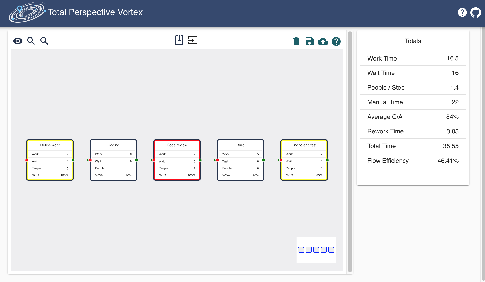

# Value Stream Map

A simple value stream mapping application to help automate a tedious manual process

## Planned Features

- [X] Local persistance
- [X] Drag and drop
- [X] Upload and download VSM
- [X] Parallel and converging value streams
- [X] Auto-calculated totals
- [ ] [PDF export](https://github.com/blikblum/pdfkit-webpack-example)
- [X] Auto Layout
- [X] Relative distance between nodes based on wait time
- [ ] Relative node size based on work time
- [ ] Toggle relative width

## Development

- `npm run dev`: Serve on port 3000
- `npm test`: Run all of the tests
- `npm run test:ci`: Test in watch mode

### Known quirks with NextJS

When running in dev mode and changing styling in MaterialUI, NextJS can get a bit lost on 
style names. Kill and re-start the dev server after style changes.

## Contributions

Thanks for considering contributing to this value stream mapping tool. We have a few requests.

1. We gladly accept tested contributions for fix or features that met the product goals.
2. Please use functional style for all contributions to keep the code consistant.

